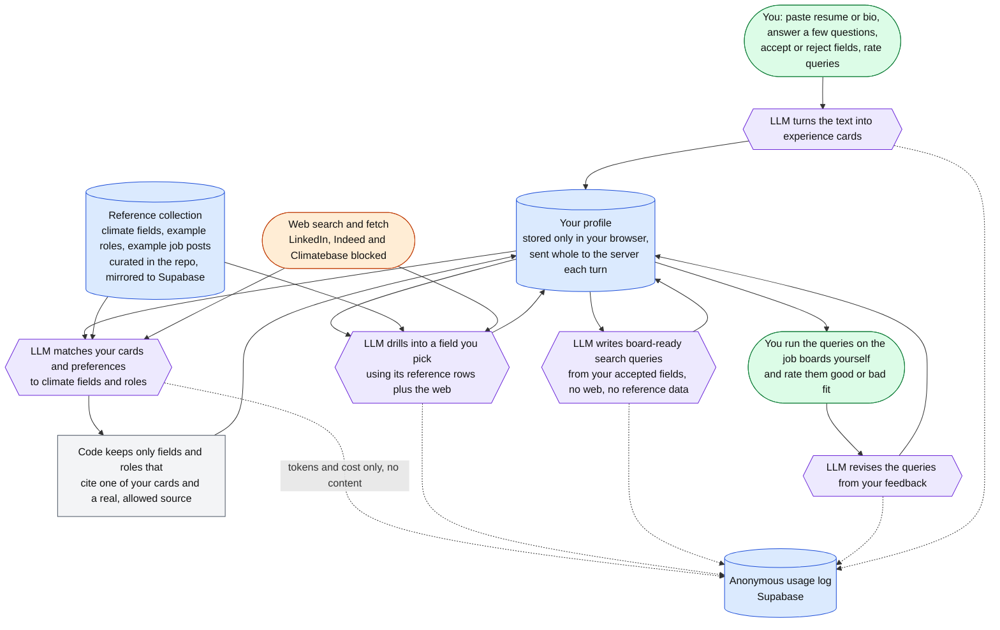

# How the app gets from a pasted resume to search queries

One diagram, kept at the level of "what talks to what". Implementation details
(models, prompts, validation rules) live in the code and PLAN.md and change
often; this stays stable. Keep it current when a step, a data store or a
source of ground truth is added or removed.

**Reading the colours.** Green is you. Blue is stored data. Purple is a model
call. Orange is the open web. Grey is a plain code check.

**Where the ground truth is.**

- Your own words: the pasted text, your answers, your accept/reject clicks
  and your query ratings. Everything the model says about you must trace back
  to a card made from your text.
- The reference collection: a small, hand-curated set of climate fields,
  example roles and example job posts kept as YAML in the repo. It explains
  fields and roles; it never powers a search.
- The web: used only to confirm employers and to source fields the
  collection lacks, with the three job boards blocked.

**Where nothing is stored.** The server keeps no profile, chat or pasted
text. Your profile lives in your browser and is resent every turn. The only
server-side write is a usage row with token counts and cost.

Last verified against the code: 2026-09-18.
